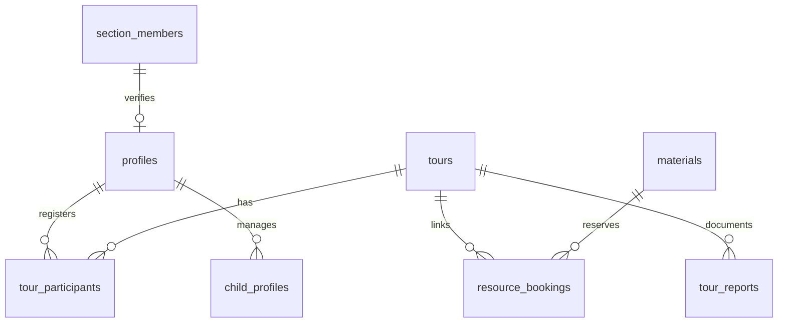

# PostgreSQL Schema & Stored Procedures (`database-schema-and-rpcs.md`)

Die Datenverarbeitung von `davpan` verwendet eine relationale PostgreSQL Datenbank auf Supabase mit strikter Datenkonsistenz und atomaren Stored Procedures (`SECURITY DEFINER`).

---

## 🗄️ Kern-Tabellen & Beziehungen

---

## ⚙️ Wichtige Stored Procedures (RPCs)

### 1. `register_for_tour_atomic`
Führt eine Tourenanmeldung atomar durch:
* Prüft Tourenstatus und verbleibende Restplätze (`max_participants`).
* Setzt den Teilnehmerstatus auf `confirmed` oder `waitlist`.
* Erstellt ggf. synchrone Materialreservierungen (`resource_bookings`).
* Schreibt Ereignis in `notification_outbox`.

### 2. `apply_participant_status_transition_atomic`
Regelt Statusänderungen von Teilnehmern (z.B. Absage oder Bestätigung):
* Verhindert unzulässige Statusübergänge via Optimistic Locking (`expected_status`).
* Bei Stornierung eines Bestätigten: Rückt den ältesten Eintrag auf der Warteliste automatisch nach.
* Passt gebuchte Ausrüstungsbestände atomar an.

### 3. `sync_participant_material_reservations_atomic`
Gleicht geliehene Materialien bei Teilnehmer-Statusänderungen ab:
* Sperrt die betroffenen Zeilen in `materials` mittels `FOR UPDATE`.
* Gibt Material bei Absage wieder für `available_quantity` frei.

### 4. `sectio_member_import_sync`
Automatische Verknüpfungsfunktion nach CSV-Import:
* Gleicht `section_members` mit `profiles` über Mitgliedsnummer und Geburtsdatum ab.
* Aktualisiert `profiles.is_section_member` und setzt Verifizierungsdaten.

---

## 📜 Migrations-Richtlinie (ADR Compliant)

* **Migrationen sind unveränderlich**: Bestehnde Dateien in `supabase/migrations/` dürfen **niemals** im Nachhinein editiert werden.
* **Neue Migrationen anlegen**: Jede Schema- oder RPC-Änderung erfordert eine neue SQL-Datei mit aktuellem Zeitstempel (z.B. `YYYYMMDDHHMMSS_beschreibung.sql`).
* **Search Path Security**: Alle `SECURITY DEFINER` Funktionen müssen explizit `SET search_path TO 'public', 'pg_temp'` deklarieren, um Schema-Hijacking zu verhindern.

---
*Zurück zur [Wiki-Übersicht](file:///c:/Users/paulw/WebstormProjects/davpan/docs/README.md)*
