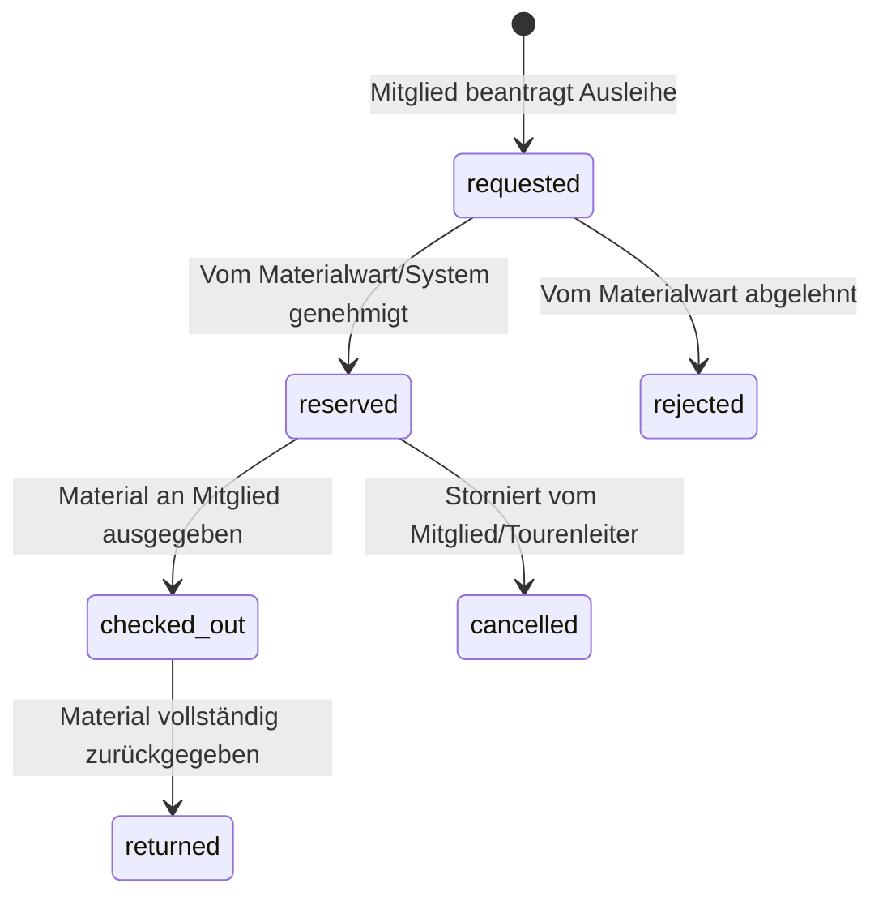

# Material- & Ausrüstungsverleih (`material-verleih.md`)

Die DAV Sektion Pfarrkirchen stellt ihren Mitgliedern Bergsportausrüstung (z.B. LVS-Sets, Steigeisen, Eispickel, Klettersteigsets, Helme) zur Verfügung. Das Material-Modul regelt den Inventarbestand, Reservierungen und Ausgaben.

---

## 📦 Inventarstruktur & Kategorien

Die Ausrüstung wird in zwei zentralen Tabellen verwaltet:

1. **`materials` (Materialstamm)**:
   * `name`: Bezeichnung der Ausrüstung (z.B. "Mammut Barryvox LVS-Gerät").
   * `category`: Kategorie (z.B. LVS/Lawine, Klettern, Hochtour).
   * `total_quantity`: Gesamtbestand der Sektion.
   * `available_quantity`: Aktuell für Ausleihe verfügbare Anzahl.
   * `requires_approval`: Kennzeichen, ob Materialwart-Freigabe erforderlich ist.

2. **`resource_bookings` (Reservierungen & Buchungen)**:
   * `material_id`: Referenz zum Materialstamm.
   * `user_id`: Ausleihendes Mitglied.
   * `tour_id`: (Optional) Anbindung an eine Sektionstour.
   * `quantity`: Reservierte Stückzahl.
   * `status`: Status der Reservierung.
   * `start_date` / `end_date`: Verleihzeitraum.

---

## 🔄 Status-State Machine für Buchungen (`booking_status`)



---

## 🔒 Atomare Bestandsprüfung (`apply_material_reservation_transition_atomic`)

Um Überbuchungen bei gleichzeitigem Zugriff zu verhindern, erfolgt die Buchungsänderung über eine atomare Stored Procedure:

```sql
-- Verkürztes Schema des Bestands-Check Locks in Postgres
SELECT total_quantity, available_quantity 
FROM materials 
WHERE id = p_material_id 
FOR UPDATE;
```

* **Bestandsschutz**: Bei jeder Zuweisung wird geprüft, ob `available_quantity >= quantity` gilt. Falls nicht, bricht die Transaktion mit dem Fehlercode `inventory_exceeded` ab.
* **Automatische Freigabe**: Bei Rückgabe (`returned`) oder Stornierung (`cancelled`) wird `available_quantity` atomar wieder erhöht.

---

## 👨‍💼 Materialwart-Dashboard (`/admin/material`)

Der Sektions-Materialwart verfügt über ein eigenes Verwaltungsinterface:
* **Offene Anträge**: Genehmigung oder Ablehnung manuell quittierungspflichtiger Gegenstände.
* **Ausgabe & Rücknahme**: Erfassung von Warenausgängen und Zustandskontrollen.
* **Inventur & Wartung**: Sperrung defekter Gegenstände für Reparaturen.

---
*Zurück zur [Wiki-Übersicht](file:///c:/Users/paulw/WebstormProjects/davpan/docs/README.md)*
