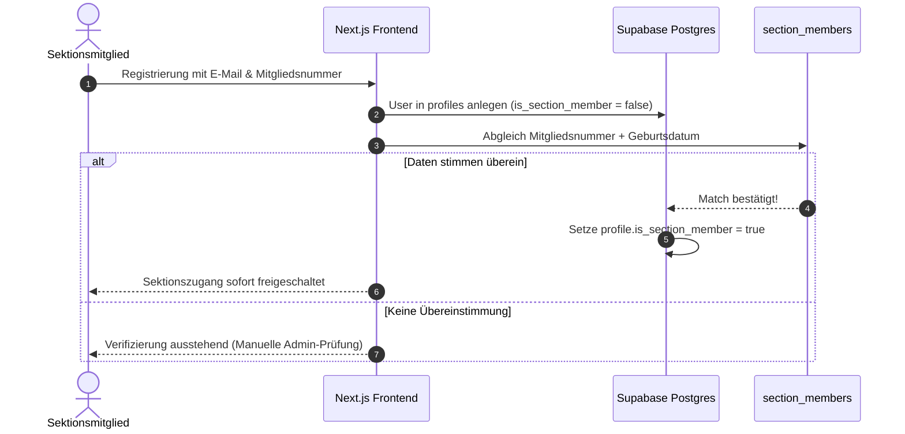

# Mitgliederverwaltung & CSV-Import (`mitglieder-und-import.md`)

Die Plattform unterscheidet zwischen registrierten Benutzern der App und dem offiziellen Stammdatenbestand der Sektion Pfarrkirchen. Der Mitglieder-Import stellt sicher, dass nur verifizierte DAV-Mitglieder exklusiven Zugriff auf Sektionsvorteile und Tourenanmeldungen erhalten.

---

## 🗄️ Stammdaten-Struktur (`section_members`)

Die Tabelle `section_members` dient als Single-Source-of-Truth für verifizierte Sektionsmitglieder:

* `membership_number`: Eindeutige 9-stellige DAV-Mitgliedsnummer (z.B. `328/00/1234`).
* `birthdate`: Geburtsdatum zur Verifikation.
* `first_name` / `last_name`: Offizieller Name.
* `is_active`: Status der Mitgliedschaft (Beitragszahler / Aktiv).

---

## 📥 CSV-Import Pipeline (`member-import-csv.ts`)

Administratoren können regelmäßige DAV-Exportdateien (CSV/JSON) im Admin-Bereich hochladen oder per Skript einspielen (`npm run import:members`).

### Verarbeitungs-Steps:
1. **Bereinigung & Normalisierung**:
   - Mitgliedsnummern werden von Leerzeichen und Sonderzeichen bereinigt.
   - Datumsformate (`DD.MM.YYYY` vs. `YYYY-MM-DD`) werden vereinheitlicht.
2. **Batch Upsert**:
   - Die Einträge werden in Batches (100–500 Datensätze) per `UPSERT` in `section_members` geschrieben.
3. **Profil-Aktivierungs-Sync (`sectio_member_import_sync`)**:
   - Wenn ein registrierter App-User (`profiles`) mit seiner Mitgliedsnummer & Geburtsdatum in `section_members` übereinstimmt, wird sein Flag `is_section_member` automatisch auf `TRUE` gesetzt.

---

## 🔑 Profil-Aktivierung & Selbstregistrierung

---

## 👨‍👩‍👧‍👦 Erziehungsberechtigten- & Familien-Workflow (Guardian Flow)

Elternteile können Kinderprofile anlegen und für Touren anmelden, ohne dass Kinder ein eigenes Smartphone oder eine E-Mail-Adresse benötigen.

### Entitäten & Tabellen:
1. **`child_profiles`**: Speichert Name, Geburtsdatum, Notfallkontakt und medizinische Hinweise des Kindes.
2. **`parent_child_relations`**: Verknüpft die Supabase `user_id` des Elternteils mit der `child_profile_id`.
3. **`child_profile_invites`**: Ermöglicht die Freigabe eines Kind-Profils für einen zweiten Erziehungsberechtigten via Einladungscode/Token.

---
*Zurück zur [Wiki-Übersicht](file:///c:/Users/paulw/WebstormProjects/davpan/docs/README.md)*
