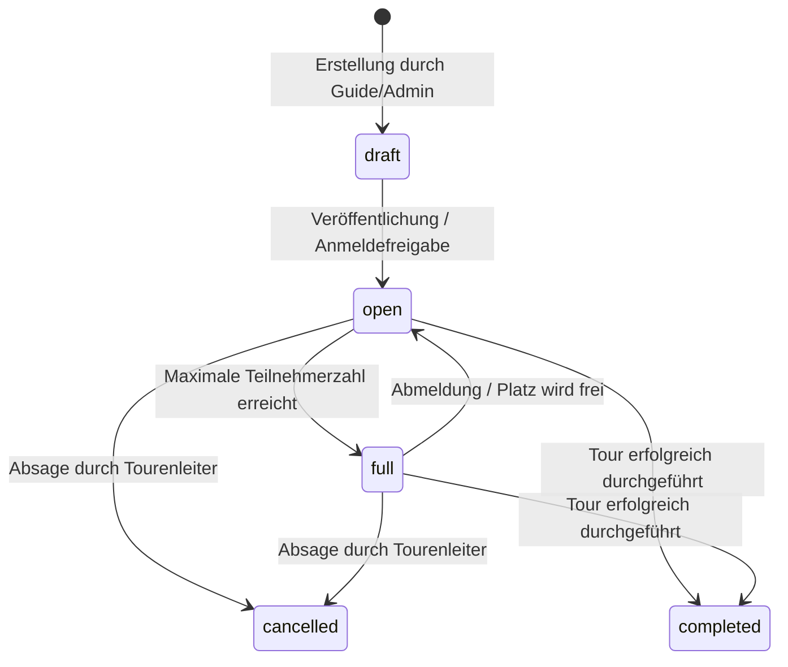

# Touren- & Kursverwaltung (`touren-und-kurse.md`)

Das Touren- und Kursmodul ist das Herzstück der DAV Pfarrkirchen Plattform. Es verwaltet den gesamten Lebenszyklus alpinistischer Unternehmungen – von der Entwurfsphase über die Registrierung bis hin zur Nachbereitung und automatischen Materialzuweisung.

---

## 🔄 Touren-Lebenszyklus & Statusübergänge (`tour_status`)

Eine Tour durchläuft folgende vordefinierte Statuszustände:

* **`draft` (Entwurf)**: Nur sichtbar für den Ersteller (Tourenleiter) und Administratoren.
* **`open` (Offen)**: Öffentlich sichtbar. Registrierung für Mitglieder geöffnet.
* **`full` (Ausgebucht)**: Plätze voll besetzt. Neue Anmeldungen rücken automatisch auf die **Warteliste** (`waitlist`).
* **`cancelled` (Abgesagt)**: Tour findet nicht statt. Registrierte Teilnehmer werden automatisch benachrichtigt.
* **`completed` (Abgeschlossen)**: Tour beendet. Tourenbericht kann eingereicht werden.

---

## 👥 Teilnehmer-Registrierung & Warteliste

### Registrierungsablauf (`registerForTour`)
1. **Identitätsprüfung**: Anmeldung durch Sektionsmitglied selbst oder durch Erziehungsberechtigte für verknüpfte Kinder-Profile (`child_profiles`).
2. **Altersvalidierung**: Prüfung des Mindestalters (`min_age`) zum Startdatum der Tour (`calculateParticipantAgeOnDate`).
3. **Atomare DB-Mutation (`register_for_tour_atomic`)**:
   - Prüfung freier Plätze (`max_participants`).
   - Falls Plätze frei: Status wird `confirmed` (oder `pending`, falls Guide-Bestätigung erforderlich).
   - Falls voll: Status wird `waitlist`.
   - Atomare Reservierung von geliehener Ausrüstung (z.B. Klettergurt, LVS-Gerät) im Lagerbestand (`sync_participant_material_reservations_atomic`).
4. **Notfallkontakt-Nachweis**: Vor Tourenantritt muss ein gültiger Notfallkontakt hinterlegt sein.

### Automatisches Nachrücken von der Warteliste (`apply_participant_status_transition_atomic`)
Wenn ein bestätigter Teilnehmer seinen Platz storniert:
1. Der abgemeldete Teilnehmer erhält den Status `cancelled`.
2. Die Datenbank ermittelt den ältesten Eintrag auf der Warteliste (`waitlist` sortiert nach `created_at`).
3. Der Wartelisten-Teilnehmer rückt automatisch nach auf Status `confirmed`.
4. Der Notification Outbox Worker versendet sofort eine Benachrichtigung an den Nachrücker.

---

## 🎒 Automatische Material-Synchronisation

Benötigt ein Teilnehmer Ausrüstung aus dem Sektionsbestand, wird bei der Tourenanmeldung angegeben, welches Material ausgeliehen werden soll.

* **Status `confirmed`**: Das Material wird in der Tabelle `resource_bookings` fest für den Teilnehmer reserviert (`reserved`).
* **Status `cancelled`**: Das reservierte Material wird automatisch freigegeben und steht dem Lager wieder zur Verfügung.
* **Status `waitlist`**: Das Material wird vorgemerkt, belegt aber noch kein festes Kontingent im Ausrüstungsverleih.

---

## 📊 Rechte & Sichtbarkeiten

* **Gäste / Nicht-Mitglieder**: Können Veröffentlichungstouren einsehen, aber sich erst nach Registrierung/Aktivierung anmelden.
* **Mitglieder (`member`)**: Können sich für Touren anmelden und eigene Stornierungen vornehmen.
* **Tourenleiter (`guide`)**: Kann eigene Touren erstellen, bearbeiten, Teilnehmerlisten verwalten, Status ändern und Tourenberichte schreiben.
* **Admins (`admin`)**: Vollzugriff auf alle Touren, manuelle Zuweisungen und Freigaben.

---
*Zurück zur [Wiki-Übersicht](file:///c:/Users/paulw/WebstormProjects/davpan/docs/README.md)*
